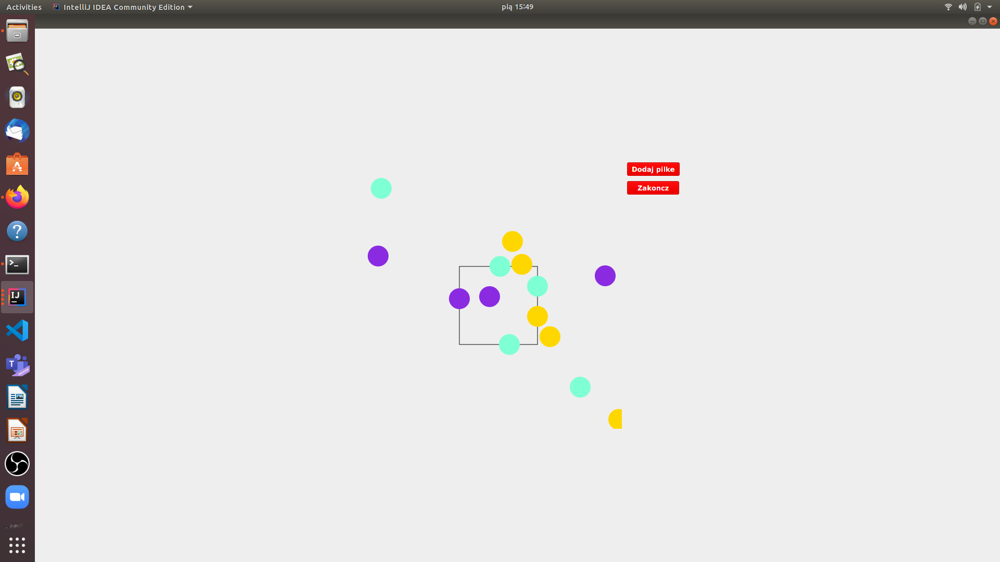

# BallInBox
> This is a JavaFX aplication using multithreading.

## BallInBox
This is a multi-threaded JavaFX aplication. Every new created ball is running using new thread. Only one ball can be inside box so anothers have to wait.
## Screenshots

## Technologies
* Java JDK11 - version 11.0.10
* JavaFX - version 11.0.2-internal

## Status
Project is:  _finished_.
